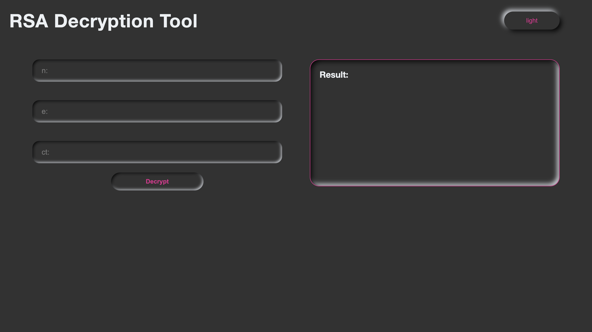

# team6 - R'sA_Hack: RSA Decryption

## サービスの概要

CTF でよく出題される RSA 問題を自動で解析・解読する Web ツール

`N`, `e`, `ct` を入力するだけで、代表的な攻撃手法を順に試し、復号結果を表示

## プレビュー

## 使用技術

Python / Flask\
HTML / CSS / JavaScript\
API: factordb

## 実装した機能

factordb を参照 → N から p,q が得られれば `solve(p,q,e,ct)`を実行\
p,q が得られない場合は順に試行: `Wiener`, `low_index`, `Fermat_factor`, `squared_index`, `N_prime`, `yafu_factor`\
入力 N,ct が複数の場合、`Håstad_attak`を実行

## 役割分担

yura / taka_hirOOoo\
フロントエンド

つぼ / ムーサン 613\
バックエンド

## アピールポイント

CTF で頻出する RSA の典型的な脆弱性（低指数、Wiener、Fermat、Håstad など）をワンクリックで試すことができる\
攻撃アルゴリズムを関数として分離しているため、今後新しい攻撃手法を容易に追加できる設計

## 改善できなかった点（実装できなかった機能）

仮にデコードが成功していた場合でも、flag に文字化けの部分が残っていたら解読失敗となってしまう点
入力が`N`, `e`, `ct`以外の場合、解読ができない点

## フィードバックが欲しい点
